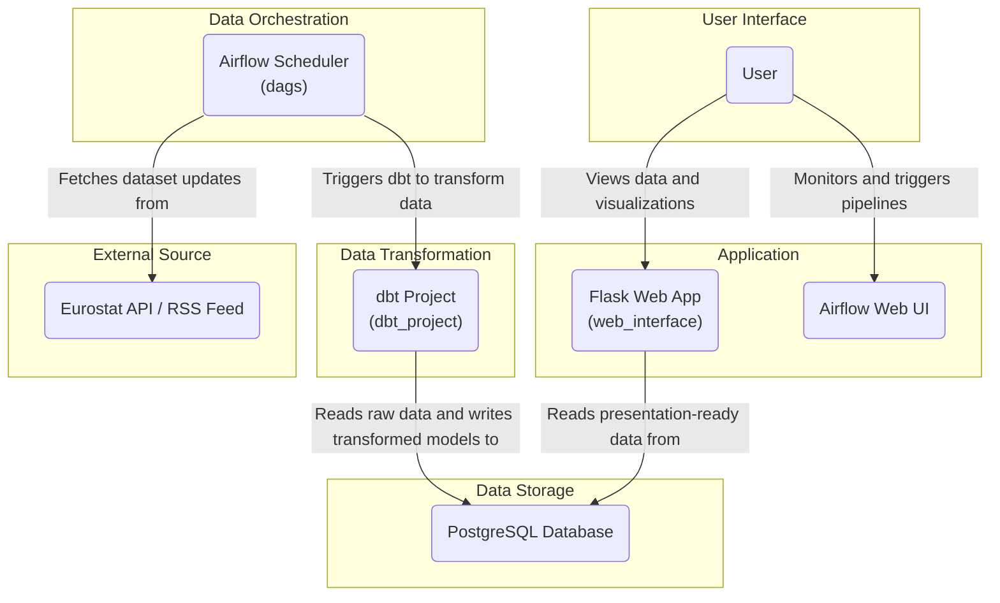

# Eurostat Data Platform

This project is a full-stack data platform designed to process, analyze, and visualize datasets from Eurostat, with a special focus on health-related statistics. It features an automated data-processing pipeline using Airflow, a dbt project for data transformation, and a Flask-based web interface for data exploration and visualization.

## System Architecture

The diagram below illustrates the flow of data from the external Eurostat API to the end-user.



## Technology Stack

### **1. Data Orchestration & Pipeline (Apache Airflow)**

*   **Framework:** **Apache Airflow** is used for authoring, scheduling, and monitoring the data pipeline workflows (DAGs).
*   **Dynamic DAG Generation:** The pipeline dynamically creates dbt models and configurations based on the datasets being processed.
*   **Operators:**
    *   `PythonOperator`: For custom Python logic like data downloading and RSS feed parsing.
    *   `DockerOperator`: To run dbt commands in an isolated container for clean dependency management.
    *   `PostgresOperator`: For executing SQL commands directly against the PostgreSQL database.
*   **Inter-Task Communication:**
    *   **XComs:** Used to pass metadata between tasks, such as sending updated dataset IDs from the RSS check to downstream processing tasks.

### **2. Data Transformation (dbt)**

*   **Core:** **dbt-core** and **dbt-postgres** for managing the transformation workflow and connecting to PostgreSQL.
*   **Modeling Strategy:**
    *   **Staging Models:** For basic cleaning, type casting, and column renaming.
    *   **Fact Models (`fct_`):** Represent key business facts with foreign keys to dimensional data.
    *   **Data Marts (`mart_`):** Aggregated, wide tables purpose-built for analytics.
*   **Features:** Jinja templating for modular SQL, custom macros, and `schema.yml` definitions for documentation and data integrity.

### **3. Backend & Web Interface (Flask)**

*   **Framework:** **Flask** serves as the core web framework.
*   **Database Connectivity:** **Psycopg2** is used to connect to PostgreSQL, with the `psycopg2.sql` module leveraged to prevent SQL injection.
*   **API & Data Handling:** Exposes a RESTful API to the frontend and uses **Pandas** for data cleaning and aggregation before serialization.
*   **Server-Side Rendering:** **Jinja2** is used for rendering HTML templates.

### **4. Frontend & Visualization**

*   **Charting Library:** **Chart.js** is used for creating interactive and responsive data visualizations, rendered client-side.
*   **Charting Plugins:** **`chartjs-plugin-datalabels`** is integrated to display numerical values on the chart bars.
*   **Styling:** UI built with **HTML5**, **CSS3**, and **Bootstrap**.

### **5. Environment & DevOps**

*   **Containerization:** **Docker** is used to containerize each component of the application.
*   **Orchestration:** **Docker Compose** defines and manages the multi-container application stack.
*   **Dependency Management:** Dependencies are managed via `requirements.txt`.
*   **Version Control:** **Git** is used for version control.

## Project Structure

```
.
├── dags/                  # Airflow DAGs for data orchestration
├── dbt_project/           # dbt project for data transformation
├── scripts/               # python scripts for data ingestion, dbt models generation
├── web_interface/         # Flask web application and API
│   ├── app.py             # Main Flask application file
│   └── templates/         # HTML templates for the web UI
├── docker-compose.yml     # Defines and configures all services
├── Dockerfile             # Dockerfile for the web application
├── requirements.txt       # Python dependencies
└── README.md              # This file
```

## Getting Started

To get the project running locally, follow these steps:

1.  **Prerequisites:**
    *   Docker must be installed on your system.
    *   Ensure you have a `.env` file configured with your environment variables (e.g., database credentials).

2.  **Clone the Repository:**
    ```bash
    git clone <repository-url>
    cd <repository-directory>
    ```

3.  **Build and Run the Containers:**
    Use Docker Compose to build the images and start all the services in detached mode.
    ```bash
    docker compose -f docker-compose.yml -f docker-compose-airflow.yaml up -d --build
    ```

4.  **Access the Services:**
    *   **Web Interface:** Open your browser and navigate to `http://localhost:5001`.
    *   **Airflow UI:** Open your browser and navigate to `http://localhost:8080`.
    *   **PgAdmin UI:** Open your browser and navigate to `http://localhost:5050`.

This will start the Flask web application, the Airflow scheduler and webserver, and the PostgreSQL database.
